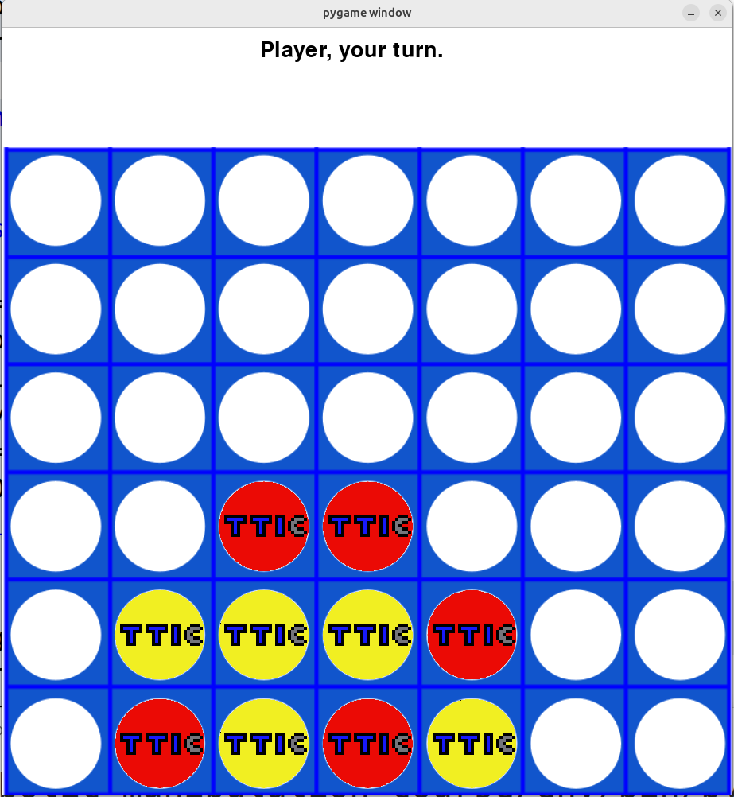

# Connect Four

**Goal:** Students build a graphical Connect Four game and add a computer player using strategy search.

**Duration:** 4-10 class hours.

**Prerequisites:** Pygame, lists, functions, board games, and an introduction to minimax.

## Overview

Connect Four is the most advanced graphics-based game in the current curriculum draft. Students create a board, drop red and yellow tokens into columns, detect wins, and play against a computer strategy.

## Learning Objectives

- Represent a two-dimensional board.
- Convert mouse position into a board column.
- Animate a token dropping into a column.
- Detect horizontal, vertical, and diagonal wins.
- Evaluate board states.
- Use minimax to choose computer moves.

## Materials

Students need two transparent PNG token images. The repository includes red and yellow token assets and a Connect Four board image.

## Strategy Levels

The draft code supports a useful progression:

| Level | Strategy |
| --- | --- |
| 0 | Choose a random legal column. |
| 1 | Win if possible, otherwise block if necessary, otherwise random. |
| 2 | Use minimax after checking immediate wins and blocks. |

## Lesson Flow

1. Build the board representation.
2. Render the board and token assets.
3. Let the player choose columns with the mouse.
4. Update the lowest empty row in a column.
5. Add win detection.
6. Add a simple computer player.
7. Add minimax and a board-evaluation function.

## Continuity

Connect Four extends the same ideas as Tic-Tac-Toe: legal moves, board state, winner detection, and computer strategy. The larger board makes brute-force search harder, so students see why heuristics and depth limits matter.

## Repository Code

- Connect Four program and assets: <https://github.com/ripl/hs-robotic-manipulation-course/tree/main/python/2025_ARM>
