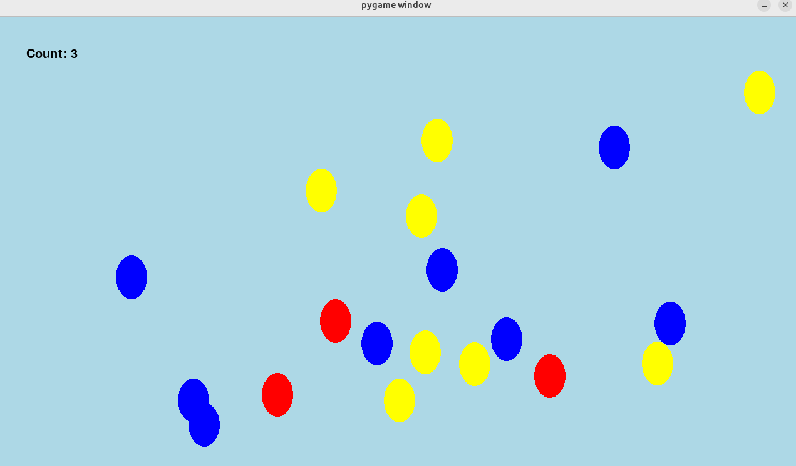

# Pop the Balloon

<div class="module-summary" markdown>
**Goal:** Students build a Pygame click-target game and extend it with moving balloon objects.

**Duration:** 1-3 class hours depending on extension depth.

**Prerequisites:** Python functions, variables, conditionals, and basic Pygame drawing.
</div>

## Overview

Students make a simple graphics program where a balloon appears on the screen. When the user clicks the balloon, the score increases and the balloon moves to a random location.

The extension adds many balloons, moving objects, color-specific targets, and a `Balloon` class.

## Learning Objectives

- Use the Pygame event loop.
- Track mouse clicks.
- Detect whether a click hits a circle or ellipse.
- Randomly place visual objects.
- Draw score text.
- Use a class to represent balloons with color, position, movement, and collision behavior.

## Lesson Flow

1. Students play an unplugged balloon activity in small groups.
2. Groups discuss how a computer could decide whether a mouse click hit a balloon.
3. Students build a single-balloon Pygame version.
4. Students customize colors, size, and background.
5. Students extend the game with multiple moving balloons.

## Collision Check

The basic version treats the balloon like a circle and checks whether the mouse is within the radius:

```python
def check_circle_collision():
    mouse_pos = pygame.mouse.get_pos()
    distance = math.sqrt(
        (mouse_pos[0] - circle_pos[0]) ** 2
        + (mouse_pos[1] - circle_pos[1]) ** 2
    )
    return distance < radius
```

## Class-Based Extension

The extension gives each balloon its own color, position, and movement behavior.



Discussion prompts:

- What information should each balloon remember?
- What methods should a balloon know how to perform?
- Why is a class cleaner than separate lists of positions, colors, and speeds?

## Continuity

Pop the Balloon gives students a concrete reason to learn objects and classes. That prepares them for robot and game code where each object has state and behavior.

## Repository Code

- Balloon examples: <https://github.com/ripl/hs-robotic-manipulation-course/tree/main/python/2025_ARM>
- Pygame basics: <https://github.com/ripl/hs-robotic-manipulation-course/blob/main/python/graphics/BASICS.md>
