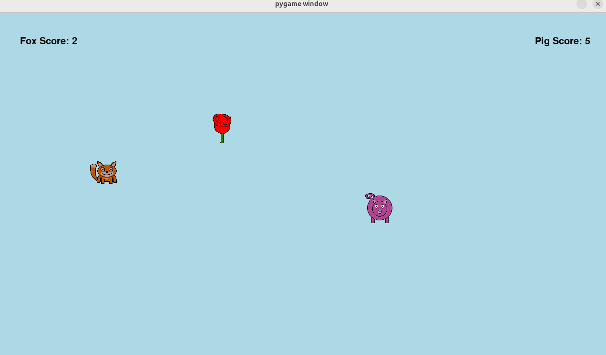
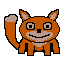

# Race for the Treasure

**Goal:** Students build a two-player Pygame race where players move sprites to collect a treasure.

**Duration:** 1-2 class hours.

**Prerequisites:** Pygame basics, functions, variables, rectangles, and keyboard events.

## Overview

Students create three image assets: player 1, player 2, and a treasure. Player 1 uses `WASD`; player 2 uses the arrow keys. Both players race to reach the treasure. The first player to touch it earns a point, and the treasure reappears in a random location. The first player to 10 points wins.

## Learning Objectives

- Load transparent PNG sprites.
- Use `pygame.Rect` objects for positioning.
- Move sprites with keyboard events.
- Detect collisions between rectangles.
- Track two scores and display them on the screen.
- Randomize object positions after a collision.

## Assets

The draft curriculum uses small transparent sprites:

Students can make their own sprites with [Piskel](https://www.piskelapp.com/). A 64-by-64 canvas works well for this module.

## Lesson Flow

1. Students create or choose three transparent PNG assets.
2. Students load and scale the images in Pygame.
3. Students bind `WASD` and arrow-key controls.
4. Students add treasure collision detection.
5. Students add scorekeeping and a win condition.

## Continuity

This module moves students from static drawing to sprite-based interaction. It prepares them for board-game GUIs where image assets must be placed according to game state.

## Repository Code

- Sprite assets and game examples: <https://github.com/ripl/hs-robotic-manipulation-course/tree/main/python/2025_ARM>
