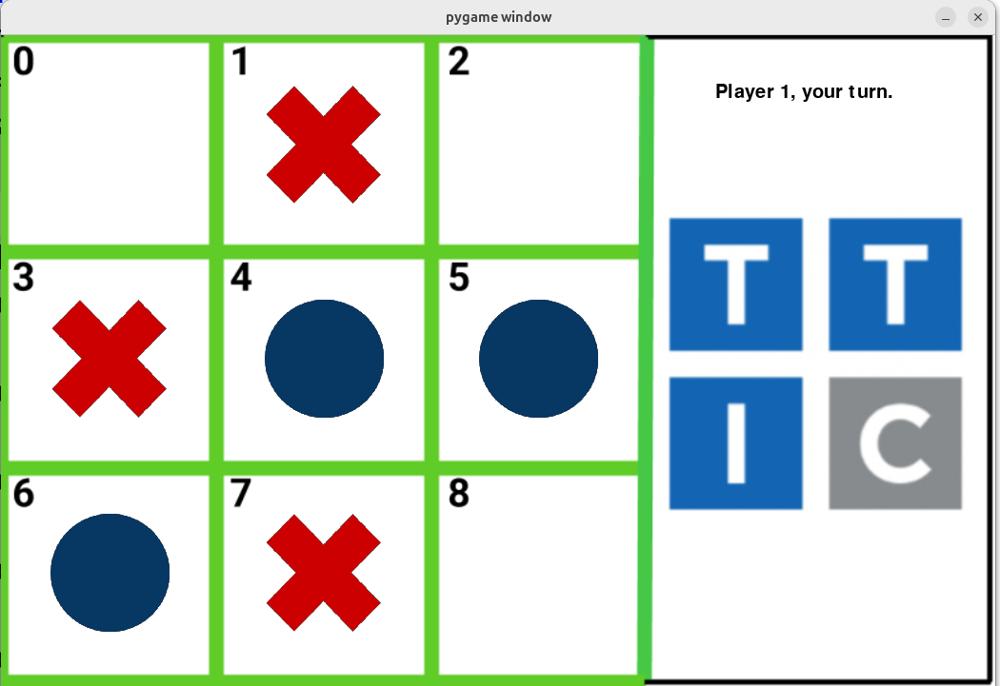

# Tic-Tac-Toe GUI

**Goal:** Students turn terminal Tic-Tac-Toe into a Pygame board with visual pieces.

**Duration:** 3-5 class hours.

**Prerequisites:** Tic-Tac-Toe game logic, lists, functions, Pygame basics, and image assets.

## Overview

Students create a graphical Tic-Tac-Toe game. The board is drawn with image assets, and players place red `X` and blue `O` pieces by selecting square numbers.

## Learning Objectives

- Carry terminal-game state into a graphical interface.
- Render board state from a Python list.
- Load and place transparent image assets.
- Handle keyboard input for square selection.
- Display turn and end-game messages.
- Reuse winner-detection logic from the text version.

## Materials

Students need two transparent PNG game pieces. They can create them in [Piskel](https://www.piskelapp.com/) with a 64-by-64 canvas, or create images in slides and remove backgrounds with [Photopea](https://www.photopea.com/).

## Lesson Flow

1. Review the terminal Tic-Tac-Toe board representation.
2. Create or provide `X` and `O` image assets.
3. Draw the board background.
4. Map board indices to screen locations.
5. On each keypress, update the board list.
6. Redraw pieces from the board list.
7. Detect wins and ties.

## Continuity

This module is a direct bridge to robotic Tic-Tac-Toe. The same board indices later correspond to camera-detected board squares and robot placement positions.

## Repository Code

- Pygame/game assets: <https://github.com/ripl/hs-robotic-manipulation-course/tree/main/python/2025_ARM>
- Robot Tic-Tac-Toe game code: <https://github.com/ripl/hs-robotic-manipulation-course/tree/main/robotics/game>
