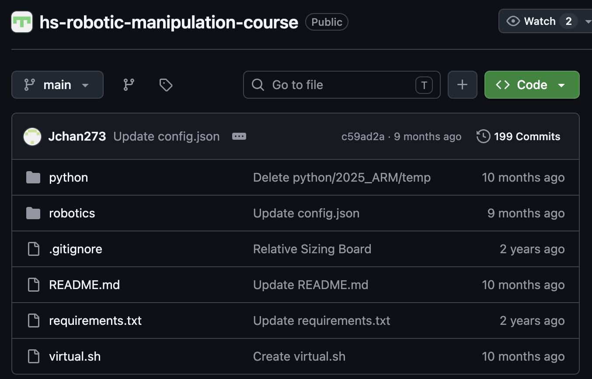

# Setup

This page collects the student laptop and robot software setup steps used by the course.

## Install Visual Studio Code

1. Search for `code` in the App Center and install Visual Studio Code.
2. Open a project directory with `code .` from the terminal.
3. When prompted, trust the authors of the course folder.

## Clone the Course Repository

The public course repository is:

<https://github.com/ripl/hs-robotic-manipulation-course>



1. Press the green **Code** button and copy the HTTPS URL.
2. In a terminal, navigate to the directory where the repository should live.
3. If needed, install Git:

```bash
sudo apt install git
```

4. Clone the repository:

```bash
git clone https://github.com/ripl/hs-robotic-manipulation-course.git
cd hs-robotic-manipulation-course
```

## Set Up Python

The repository includes a helper script, `virtual.sh`, and a standard `requirements.txt`.

```bash
chmod +x ./virtual.sh
./virtual.sh
source env/bin/activate
pip install -r requirements.txt
```

When returning to the project later, activate the environment again:

```bash
source env/bin/activate
```

Deactivate when finished:

```bash
deactivate
```

## Install Dynamixel Wizard 2.0

Install Linux dependencies:

```bash
sudo apt install libxcb-icccm4 libxcb-image0 libxcb-keysyms1 libxcb-render-util0
```

Then download the Linux x64 installer from the Robotis documentation:

<https://docs.robotis.com/docs/software/dynamixel_wizard_2_0/introduction/>

From the download directory:

```bash
chmod 755 DynamixelWizard2Setup-linux-x64.run
./DynamixelWizard2Setup-linux-x64.run
```

Follow the installer prompts.

## Troubleshooting Python Builds

On some Linux machines, Python or package installation may require development libraries:

```bash
sudo apt update
sudo apt install -y make build-essential libssl-dev zlib1g-dev \
  libbz2-dev libreadline-dev libsqlite3-dev wget curl llvm \
  libncurses5-dev libncursesw5-dev xz-utils tk-dev \
  libffi-dev liblzma-dev python3-openssl git
```

## Safety

Before controlling the arm, confirm that students know how to disconnect power. Use small position changes when first testing motors. A large command can drive the arm into the table or into itself.
